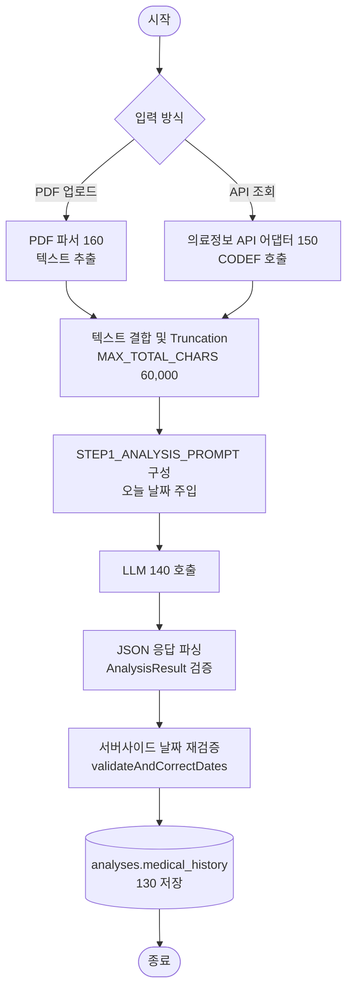
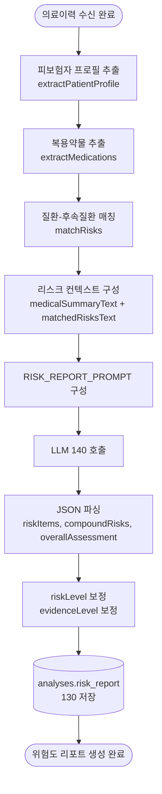
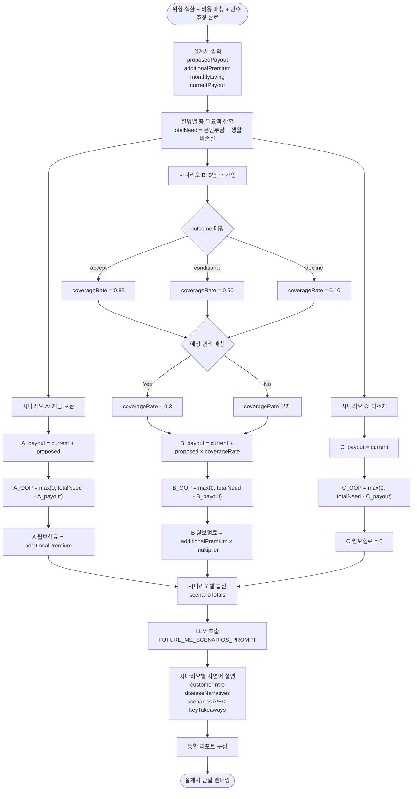
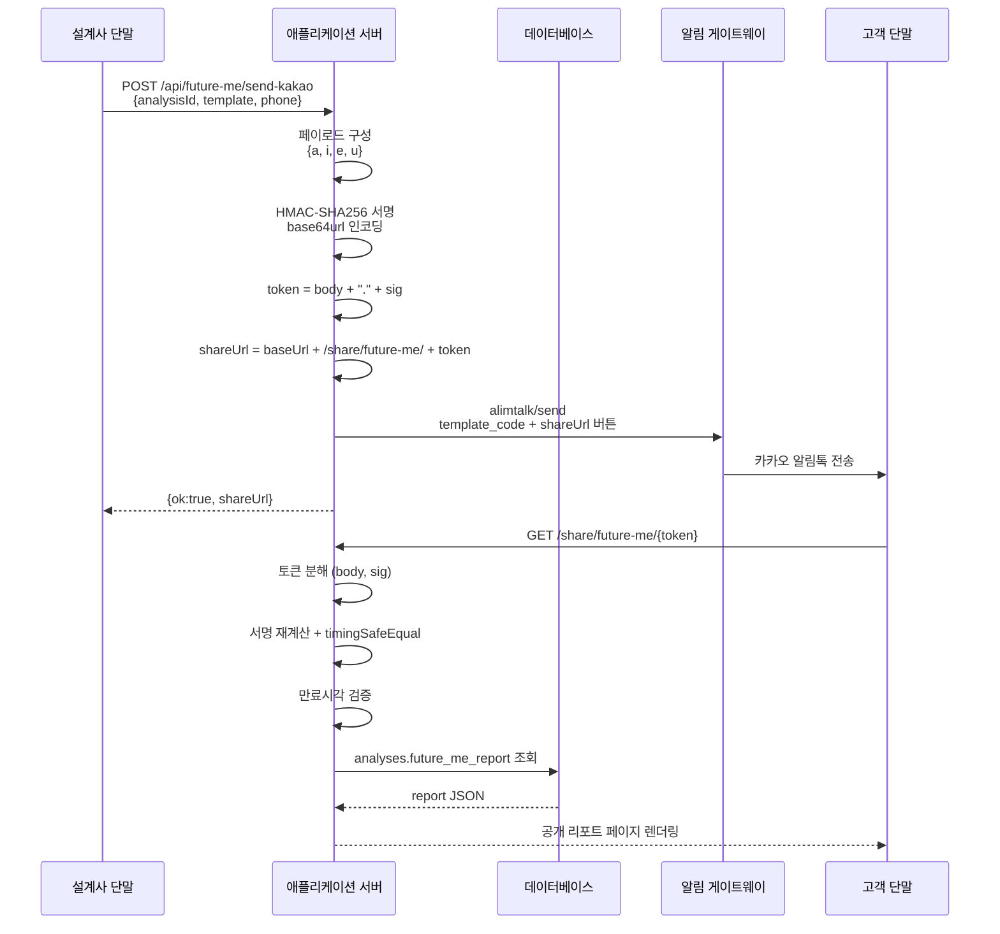
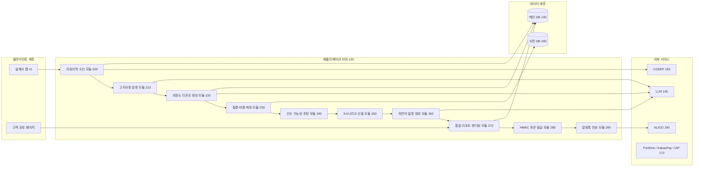

# 【도면】 — 도면 설계 및 제작 가이드

> 본 문서는 변리사 또는 도면 제작자(일러스트레이터)에게 전달할 **도면 설계 원안**이다.
> 실제 출원 시에는 각 도면을 별도 이미지 파일(JPG/PDF, 흑백, 300dpi 이상)로 제작하여 첨부한다.
> 아래 Mermaid 다이어그램은 초안이며, 특허청 제출용은 반드시 정식 블록도/흐름도로 재제작해야 한다.

---

## 도면 제작 공통 규격

| 항목 | 요구사항 |
|---|---|
| 파일 포맷 | JPG / PNG / PDF |
| 색상 | 흑백(grayscale) 권장 |
| 해상도 | 300dpi 이상 |
| 용지 | A4 세로 (210mm × 297mm) |
| 여백 | 상하좌우 각 2cm |
| 글자 크기 | 6포인트 이상 |
| 부호 표기 | 명세서 【부호의 설명】과 일치 (100, 110, 120 등) |
| 도면 번호 | 좌측 상단 "도 1", "도 2" 등 명시 |

---

## 도 1 — 전체 시스템 구성도

**목적**: 본 발명 시스템의 주요 구성요소와 상호 관계 표시

```mermaid
graph TB
    A[설계사 클라이언트<br/>110] -->|HTTPS| B[애플리케이션 서버<br/>120]
    B -->|SQL| C[(데이터베이스<br/>130)]
    B -->|REST| D[인공지능 LLM 서비스<br/>140]
    B -->|REST| E[의료정보 API 어댑터<br/>150]
    B -->|로컬| F[PDF 파서<br/>160]
    B -->|REST| G[결제 오케스트레이터<br/>170]
    B -->|REST| H[알림 게이트웨이<br/>180]
    B -.조회.->|SQL| I[(사전 데이터베이스<br/>190)]

    E -->|조회| J[(심평원 / 건보공단)]
    D -->|프롬프트+응답| K[Claude / GPT]
    G -->|결제| L[PortOne / 카카오페이 / Apple·Google IAP]
    H -->|알림톡| M[ALIGO / 카카오]
```

**부호**:
- 110: 설계사 클라이언트 (웹/모바일)
- 120: 애플리케이션 서버 (Next.js)
- 130: 메인 데이터베이스 (PostgreSQL)
- 140: LLM 서비스 어댑터
- 150: 의료정보 API 어댑터 (CODEF)
- 160: PDF 파서
- 170: 결제 오케스트레이터
- 180: 알림 게이트웨이
- 190: 사전 데이터베이스 (질환/비용/치료)

---

## 도 2 — 의료이력 수신 및 고지사항 분류 플로우

**목적**: 의료이력 입력 → PDF/API 파싱 → LLM 분류 → 서버사이드 날짜 재검증



**핵심 포인트**: "서버사이드 날짜 재검증"은 본 발명의 기술적 특징이므로 명확히 표시.

---

## 도 3 — 위험도 리포트 생성 플로우



---

## 도 4 — 5년 후 인수 가능성 추정 휴리스틱 (핵심 도면)

**목적**: 본 발명의 **핵심 알고리즘**을 명시. 수치 한정 청구항 3·4 대응.

```mermaid
flowchart TD
    Start([의료이력 + 위험도 리포트]) --> Init[score = 0<br/>factors = []<br/>exclusions = []]

    Init --> Step1[진단코드 가중치 적용]
    Step1 --> D1{코드 매칭}
    D1 -->|C*| C1[score += 40]
    D1 -->|I21| C2[score += 35]
    D1 -->|I63| C3[score += 35]
    D1 -->|N18| C4[score += 30]
    D1 -->|E11| C5[score += 15]
    D1 -->|기타| C6[매핑된 가중치 적용]

    C1 --> Step2[위험 리포트 Top 5 처리]
    C2 --> Step2
    C3 --> Step2
    C4 --> Step2
    C5 --> Step2
    C6 --> Step2

    Step2 --> Level{위험수준}
    Level -->|high| Mul1[× 1.0]
    Level -->|moderate| Mul2[× 0.6]
    Level -->|low| Mul3[× 0.3]
    Mul1 --> CatWeight[카테고리 가중치 × 배율 가산]
    Mul2 --> CatWeight
    Mul3 --> CatWeight

    CatWeight --> Step3{복용약물}
    Step3 -->|5종 이상| M1[+8]
    Step3 -->|3종 이상| M2[+4]
    Step3 -->|미만| M3[+0]

    M1 --> Step4{위험 플래그}
    M2 --> Step4
    M3 --> Step4
    Step4 -->|high| F1[+10]
    Step4 -->|medium| F2[+4]
    Step4 -->|none| F3[+0]

    F1 --> Normalize[clamp 0~100<br/>declineRiskScore]
    F2 --> Normalize
    F3 --> Normalize

    Normalize --> Outcome{점수}
    Outcome -->|>= 60| Decline[likely_decline]
    Outcome -->|30~59| Conditional[conditional]
    Outcome -->|< 30| Accept[likely_accept]

    Decline --> Premium[expectedPremiumMultiplier<br/>= 1.0 + min<br/>0.5, score × 0.006]
    Conditional --> Premium
    Accept --> Premium

    Premium --> Return[UnderwritingEstimate 반환<br/>outcome, score, factors,<br/>premiumMultiplier, exclusions]
    Return --> End([종료])
```

---

## 도 5 — 3시나리오 산출 로직 (대표도 후보)

**목적**: 본 발명의 결과물 핵심. 청구항 1의 시나리오 산출 단계 직접 대응.



**이 도면은 청구항 1의 (e), (f), (g) 단계 각각에 대응되므로 명세서 설명과 부호 대응 필수.**

---

## 도 6 — 통합 리포트 출력 화면 예시 (스크린 목업)

**목적**: 실제 리포트 레이아웃을 보여주어 실시가능성(enablement) 입증.

구성 요소 (위에서 아래로):
1. 표지 카드: "미래의 나 — 보험 시나리오 비교" 제목 + 생성일자 + 주요 입력값 4개 (설계 보험금, 추가 월 보험료, 현재 보험금, 월 생활비)
2. 고객 안내문(customerIntro) — 지문형 블록
3. 상담 포인트(keyTakeaways) — 1·2·3 번호 리스트
4. 위험 프로필 섹션 — 상위 위험 질환 카드 그리드 (발병 가능성 자연어 + 왜 위험한지 설명)
5. 5년 후 인수 추정 섹션 — outcome 뱃지 + 점수 게이지 + 불리 요인 리스트 + 예상 면책 항목
6. 시나리오 A/B/C 비교 카드 3개 (emerald/amber/rose) — headline + body + highlights + 보험금/자기부담/월보험료
7. 질병별 가상영수증 섹션 — 질환별 카드에 치료/비용근거/생활영향/시나리오별 자기부담 표시
8. 면책 고지문

> **도면 제작 시**: 실제 스크린샷을 단순 블록도로 재제작 (글자는 가독 가능한 수준으로 축약).

---

## 도 7 — HMAC 토큰 공유 및 알림톡 발송 플로우



---

## 도 8 — 시스템 블록도 (청구항 10·11 대응)

**목적**: 시스템 청구항 대응 모듈 분해도.



---

## 도면 제작 발주 체크리스트

- [ ] 각 도면을 별도 파일로 저장 (`도1.pdf`, `도2.pdf` ...)
- [ ] 부호(100, 110 등)를 명세서와 완전 일치
- [ ] 화살표 방향 일관성 (입력 → 처리 → 출력)
- [ ] 한글 표기 (특허청 제출은 한국어 원칙)
- [ ] 흑백 출력 시 구분 가능한 테두리/패턴 사용
- [ ] 도 5 또는 도 1을 **대표도**로 지정하여 요약서 첨부

## 자체 제작 가능한 도구

- **Draw.io** (diagrams.net) — 무료, 특허 도면 스타일 지원
- **Mermaid Live Editor** — 위 Mermaid 소스를 바로 렌더링 후 PDF 내보내기
- **Figma** — 도 6 UI 목업 제작에 적합
- **LaTeX TikZ** — 고품질 블록도

## ⚠️ 주의사항

- 실제 서비스 스크린샷을 그대로 첨부하면 권리범위가 좁아질 수 있음. **추상화된 블록도**로 재구성 권장.
- 도면 내 텍스트는 **한글 우선**, 필요 시 영문 병기.
- AI 생성 이미지는 저작권·재현성 이슈로 권장하지 않음.
